# Whack-A-Rat
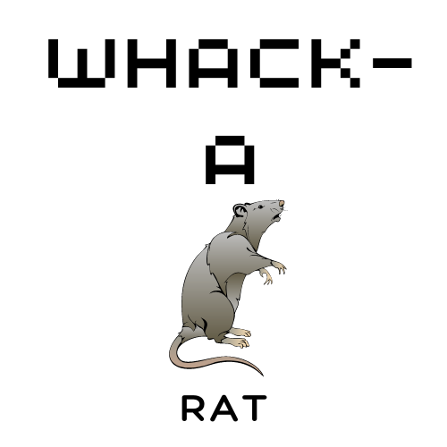

Welcome to Whack-a-Rat, a classic game built with HTML, CSS, and JavaScript! The objective of the game is to whack as many rats as possible in 60 seconds, while avoiding the mice that pop up among them. It's a simple yet addictive game that's suitable for players of all ages.

Whack-a-Rat is a fun and challenging way to pass the time. Whether you're looking for a quick break or a longer gaming session, Whack-a-Rat is the perfect choice. With its responsive design, you can play Whack-a-Rat on your desktop, laptop, or mobile device.
## [View The Live Project Here](https://jaycode88.github.io/msp-2/)

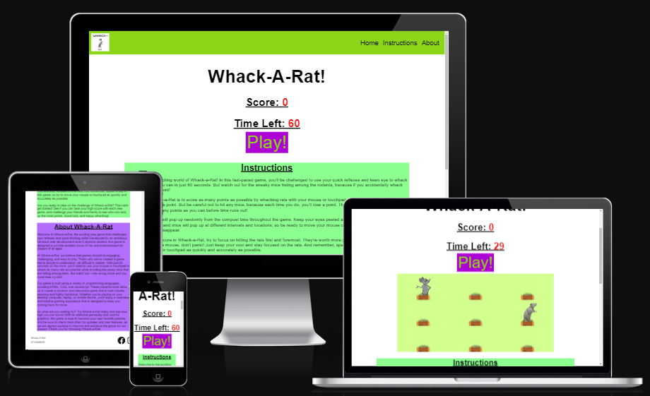

## UX
The Whack-A-Rat Game has been designed to provide an enjoyable and engaging user experience.
The game features a responsive design that adapts to different screen sizes, When using a Desktop or laptop the mouse is used to whack the animals, On a mobile device the animals are whacked using the touch pad. The gameplay rules and controls are straightforward, allowing all ages to quickly understand the game.

### Colour Scheme
I chose bright yet soft tones to keep the user's eye engaged throughout the game. I intentionally avoided using pink or blue as I wanted the game to be appealing to all sexes. Instead, I opted for a combination of bright and engaging colors that would be attractive to both younger and older players.

I believe that the color scheme of a game can have a significant impact on the user's experience, so I wanted to make sure that the colors I chose were not only visually appealing but also easy on the eyes. By using a combination of bright and soft tones, I was able to create a color scheme that was both fun and engaging, while still being comfortable to look at for extended periods of time.

I used [Design shack](https://designshack.net/articles/graphics/website-design-for-kids-tips-and-advice/) for my colour theme research.

- `#8CFF90` used for text Background.
- `#D3FF8F` used for Game play area.
- `#8CD61A` used for Navigation bar and Button text.
- `#B46EFF` used for Text Background.
- `#AD00D7` used for Button.

I used [Adobe Colour Wheel](https://color.adobe.com/create/color-wheel) to generate my colour palette.

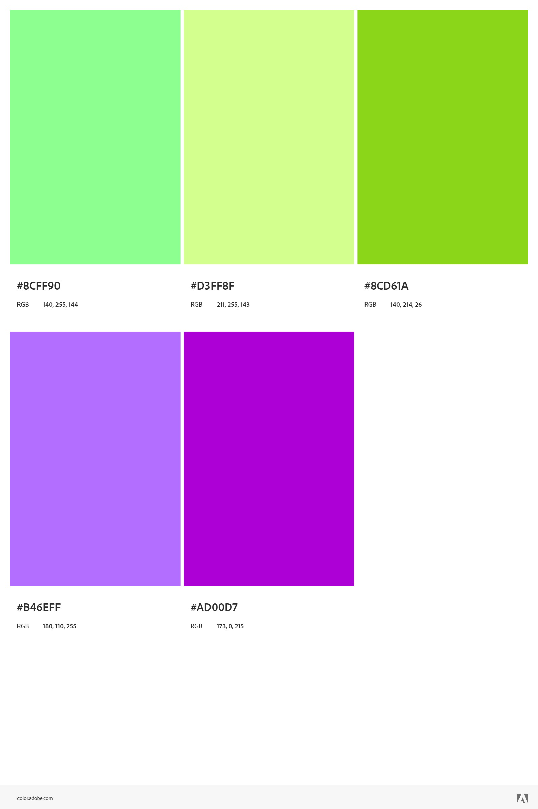

### Typography
I used [Design shack](https://designshack.net/articles/graphics/website-design-for-kids-tips-and-advice/) To research typography.

 I chose to use only sans-serif fonts. The reason for this is that sans-serif fonts are very clear and easy to read, which is important for younger children with less reading ability, as well as for older children and adults who may not be at the expected reading level.

By using a sans-serif font, I was able to ensure that all text in the game was clear and easy to read, regardless of the user's age or reading ability.

I believe that the typography of Whack-a-Rat is an important aspect of the game's design, as it ensures that all users are able to easily read and understand the instructions and scoring system.

## User Stories
The central audience to the game will be all ages looking for an engaging distraction for many reasons including, Stress relief, Challenging entertainment and General fun in down time.

### New Site Users

- As a new site user, I would like to be able to read an understand the rules of gameplay, so that I can get engaged with the game effectively.
- As a new site user, I would like to feel challenged, so that I can improve my reaction time and hand-eye cooordination skills.
- As a new site user, I would like to play a simple yet challenging game, so that I can De-stress or fill a gap in time.
- As a new site user, I would like to feel engaged , so that I can forget whats on my mind and enjoy time out.
- As a new site user, I would like to be able to navigate with ease, so that I can easily find what I am looking for.

### Returning Site Users

- As a returning site user, I would like to challenge myself, so that I can beat my previous highest score.
- As a returning site user, I would like to compare my score with freinds or fammily, so that I can create fun competition.
- As a returning site user, I would like to be familiar with gameplay, so that I can play again without a change in rules.

### Site Admin

- As a site administrator, I should have the ability to manage the game itself, so that I can adjust game settings where needed.
- As a site administrator, I should be able to customise the game, so that I can modify visual elements or add new features.

## Wireframes
To follow best practice, wireframes were developed for mobile, tablet, and desktop sizes.
I've used [Figma](https://www.figma.com/) to design my site wireframes.

| Size | Screenshot |
| --- | --- |
| Mobile | 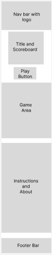 |
| Tablet | 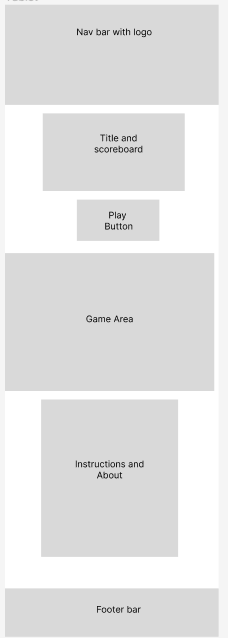 |
| Desktop | 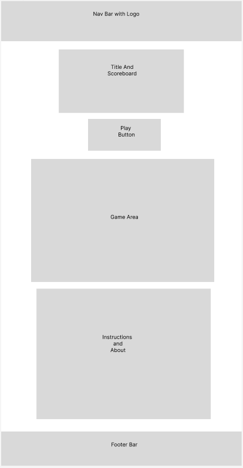 |

## High Fidelity Prototype
I used [Figma](https://www.figma.com/) to create high fidelity prototypes for mobile, tablet and desktop devices.
| Size | Screenshot |
| --- | --- |
| Mobile | 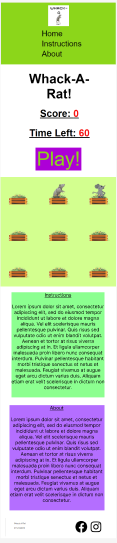 |
| Tablet | 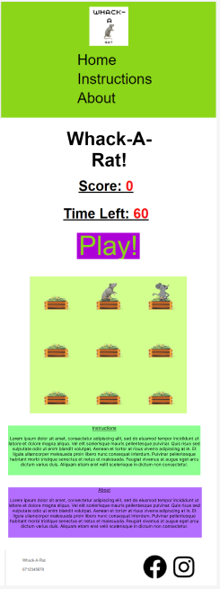 |
| Desktop | 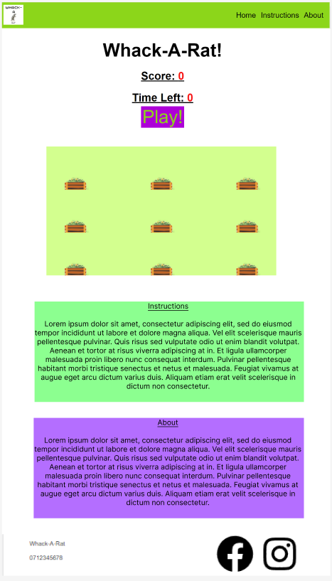 |

## Features
The website is styled as one page with three sections, The first Is the Title, Scoreboard and game play area which appears when the "Play!" button is pressed. The second section displays the game play instructions which appears directly under the "Play!" button until the game is started. The third section consist of an "About" section which gives details of game play and design.

### Existing Features

- **Navigation Bar**

    - The website includes a navigation bar at the top, Which allows users to easily navigate between different sections of the site.
    - The navigation bar includes a logo and links to the Home, Instructions and About Sections.
    - The navigation bar is responsive to different screen sizes
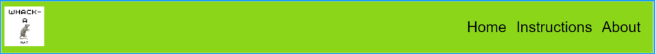
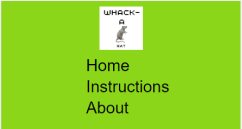

- **Title, Scoreboard and Play Button**

    - The website displays "Whack-A-Rat" as the main heading
    - A scoreboard shows the current score, Which is initially set to 0.
    - A timer indicates the time left in the game, Starting from 60 seconds.
    - A "Play!" button allows the user to start the game, Upon the user clicking the "Play!" button the game play area appears.

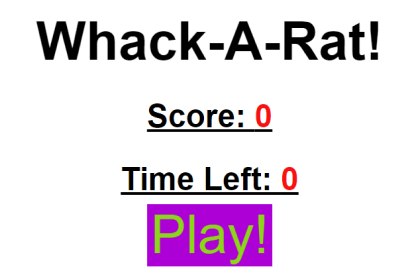

- **Game Area**

    - The Game area is a 3x3 grid of compost bins.
    - Rats and mice randomly appear from the bins.
    - Rats are worth points, and mice deduct points if accidentally clicked.
    - Rats and mice appear and disappear with animation.
    - The Game area is initially hidden and only displayed when the "Play!" button is clicked. 

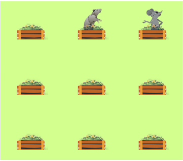

- **Instructions and About Sections**

    - The website includes an "Instructions" Section that provides an overview of the game rules and how to play.
    - The "About Whack-A-Rat" section gives information about the game, its development and the technologies used.
    - Both sections provide detailed descriptions to inform and engage users.

    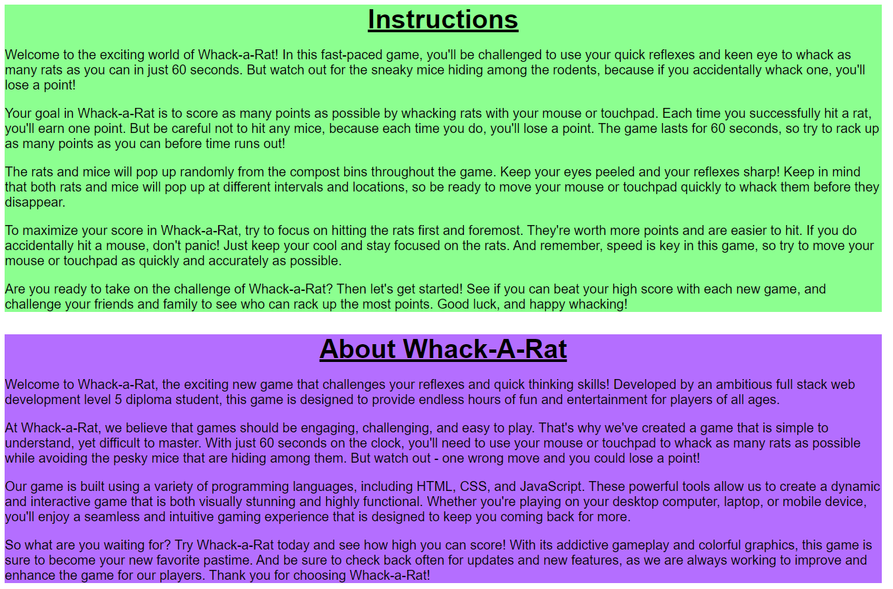

- **Footer**

    - The website has a footer section displayed at the bottom.
    - The footer includes the game name and contact information.
    - Social media links are provided for users to connect with the game's social profiles.

    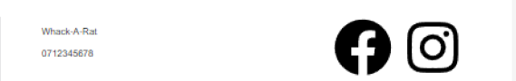

- **End of game alert**

    - When the game has finished, An Alert is displayed that informs the user that the game has ended and provides them with their score.
    - The alert also uses text to entice the user to play again. 

    

- **404 Alert Page**

    -If the user gains a 404 error response within the Rat-A-Whack site, They recieve our own 404  error response with a link within a button to take them back to the Rat-A-Whack home page.

    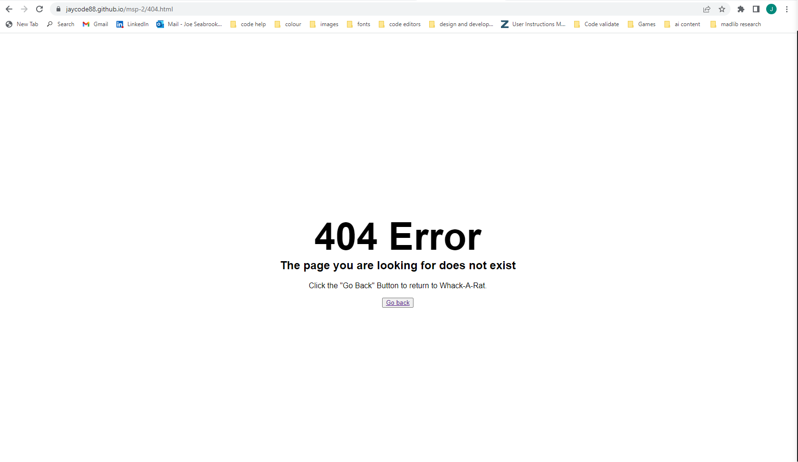

- **Responsive Design**

    - The website is designed to be responsive, adapting to different screen sizes and devices.
    - Media queries are used to adjust the layout and font size for different screen widths.
    - The game area and navigation bar are optimised for mobile screens.

### Future Features

- Local Storage Scoreboard
    - I would like to add local storage, so a user can see there previous high score when they return to the site.
- Leaderboard page
    - I believe a great addition would be a LeaderBoard page which displays the names and scores of the top 25 scorers of all time.
- Additional Levels
    - I think it would increase user engagment, If more levels were added to the game. eg. the animals appear for less time in level 2.
- Footer Bar links and information
    - The social media links and contact information needs to be updated with correct information once social media pages built.    

## Tools & Technologies Used

- [HTML](https://en.wikipedia.org/wiki/HTML) used for the main site content.
- [CSS](https://en.wikipedia.org/wiki/CSS) used for the main site design and layout.
- [CSS Flexbox](https://www.w3schools.com/css/css3_flexbox.asp) used for an enhanced responsive layout.
- [CSS Grid](https://www.w3schools.com/css/css_grid.asp) used for an enhanced responsive layout.
- [JavaScript](https://www.javascript.com) used for user interaction on the site.
- [Git](https://git-scm.com) used for version control. (`git add`, `git commit`, `git push`)
- [GitHub](https://github.com) used for secure online code storage.
- [GitHub Pages](https://pages.github.com) used for hosting the deployed front-end site.
- [Gitpod](https://gitpod.io) used as a cloud-based IDE for development.
- [Canva](https://www.canva.com/) used for logo creation and image stock.
- [Figma](https://www.figma.com/) used for wireframes and high fidelity prototypes.
- [Gimp](https://www.gimp.org/) used for image manipulation(Resizing,converting file type etc.)
- [Adobe colour wheel](https://color.adobe.com/) used for selecting colour scheme.
- [Lorem Ipsum](https://loremipsum.io/) used for placeholder text in the earlier design stages.
- [Am I Responsive](https://ui.dev/amiresponsive) used to Create visuals for responsive design.
- [Chat GPT](https://chat.openai.com/) Used for trouble shooting.
- [Copy Ai](https://app.copy.ai/) Used to create text content.
- [W3 HTML Validator](https://validator.w3.org/) used to validate HTML.
- [W3 Jigsaw CSS Validator](https://jigsaw.w3.org/css-validator/) used to validate CSS.
- [JSHint](https://jshint.com/) used to validate JavaScript code.
- [AY11 Color contrast](https://color.a11y.com/Contrast/) Used to validate colour contrast.
- [javascript30](https://javascript30.com/) Used to research how to build game(Challenge no:30 Whack-A-Mole).
- [Divya M C M at medium](https://medium.com/@divyamcm/whack-a-mole-game-using-html-css-and-javascript-84b108ec5c8e) Used to research basic code needed.
- [Design shack](https://designshack.net/articles/graphics/website-design-for-kids-tips-and-advice/) Used for design research.
- [Jest](https://jestjs.io/) https://jestjs.io/ersion 26.6.3 Used for testing.
- [W3 HTML Validator](https://validator.w3.org/) Used to validate Html.
- [W3 Jigsaw CSS Validator](https://jigsaw.w3.org/css-validator/) Used to validate CSS.

## Testing

For all testing, please refer to the [TESTING.md](TESTING.md) file.

## Deployment

The site was deployed to GitHub Pages. The steps to deploy are as follows:
- In the [GitHub repository](https://github.com/Jaycode88/msp-2), navigate to the Settings tab 
- From the source section drop-down menu, select the **Main** Branch, then click "Save".
- The page will be automatically refreshed with a detailed ribbon display to indicate the successful deployment.

The live link can be found [here](https://jaycode88.github.io/msp-2)

### Local Deployment

This project can be cloned or forked in order to make a local copy on your own system.

#### Cloning

You can clone the repository by following these steps:

1. Go to the [GitHub repository](https://github.com/Jaycode88/msp-2) 
2. Locate the Code button above the list of files and click it 
3. Select if you prefer to clone using HTTPS, SSH, or GitHub CLI and click the copy button to copy the URL to your clipboard
4. Open Git Bash or Terminal
5. Change the current working directory to the one where you want the cloned directory
6. In your IDE Terminal, type the following command to clone my repository:
	- `git clone https://github.com/Jaycode88/msp-2.git`
7. Press Enter to create your local clone.

Alternatively, if using Gitpod, you can click below to create your own workspace using this repository.

Please note that in order to directly open the project in Gitpod, you need to have the browser extension installed.
A tutorial on how to do that can be found [here](https://www.gitpod.io/docs/configure/user-settings/browser-extension).

#### Forking

By forking the GitHub Repository, we make a copy of the original repository on our GitHub account to view and/or make changes without affecting the original owner's repository.
You can fork this repository by using the following steps:

1. Log in to GitHub and locate the [GitHub Repository](https://github.com/Jaycode88/msp-2)
2. At the top of the Repository (not top of page) just above the "Settings" Button on the menu, locate the "Fork" Button.
3. Once clicked, you should now have a copy of the original repository in your own GitHub account!

### Local VS Deployment

    No Known Differences

## Credits

### Content
All worded content was first wrote by myself then edited and improved with suggestions and examples provided by [Copy.ai](https://www.copy.ai/)

This project includes code that was adapted from a tutorial by [Divya M C M](https://medium.com/@divyamcm/whack-a-mole-game-using-html-css-and-javascript-84b108ec5c8e) available at [medium](https://medium.com/). The tutorial provided valuable guidance and served as a foundation for the development of this project.

I found This [Javascript 30 day challenge](https://javascript30.com/) by [Wesbos](https://wesbos.com/) of immense help not only with practising Javascript before starting this project, but also I owe many thanks to the last(30th) challenge on the course, This is a whack-a-mole tutorial which really helped with planning and testing my javascript through the building stage. N.B I can only link to the Challenge home page not directly to the 30th challenge due to sign up needed. 

### Media
All images: Rat, Mouse, Frog and Compost Bin were provided by [Canva](https://www.canva.com/)

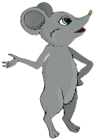
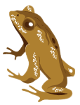
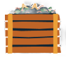

### Acknowledgements

- I would like to thank my Code Institute mentor, [Alex K](https://calendly.com/alex_mentor) for their support throughout the development of this project.
- I would like to thank Tim Nelson for his ongoing support.
- I would like to thank the [Code Institute](https://codeinstitute.net) tutor team for their assistance with troubleshooting and debugging some project issues.
- I would like to thank the [Code Institute Slack community](https://code-institute-room.slack.com) for the great advice.
- I would like to thank the freinds for there on going support and reviewing of game.
