# Testing

Return back to the [README.md](README.md) file.

I have used various tools to Test Funcionality, Validity and responsiveness. I have been sure to check all layouts, colours, text, forms, links, buttons are functioning on all devices and screen sizes that I have tested.

## Code Validation

### HTML

I have used the recommended [HTML W3C Validator](https://validator.w3.org) to validate all of my HTML files.

- link to results: https://validator.w3.org/nu/?doc=https%3A%2F%2Fjaycode88.github.io%2Fmsp-2

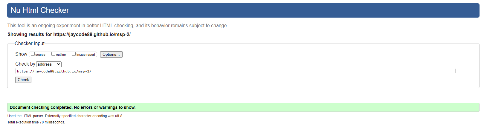

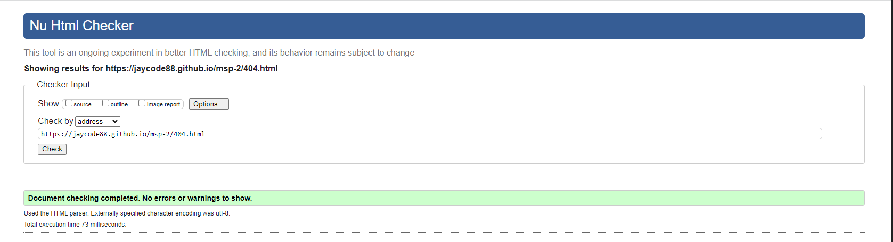

### CSS

I have used the recommended [CSS Jigsaw Validator](https://jigsaw.w3.org/css-validator) to validate all of my CSS files.

- link to results: https://jigsaw.w3.org/css-validator/validator?uri=https%3A%2F%2Fjaycode88.github.io%2Fmsp-2%2F&profile=css3svg&usermedium=all&warning=1&vextwarning=&lang=en


### JavaScript

I have used the recommended [JShint Validator](https://jshint.com) to validate my JS file.

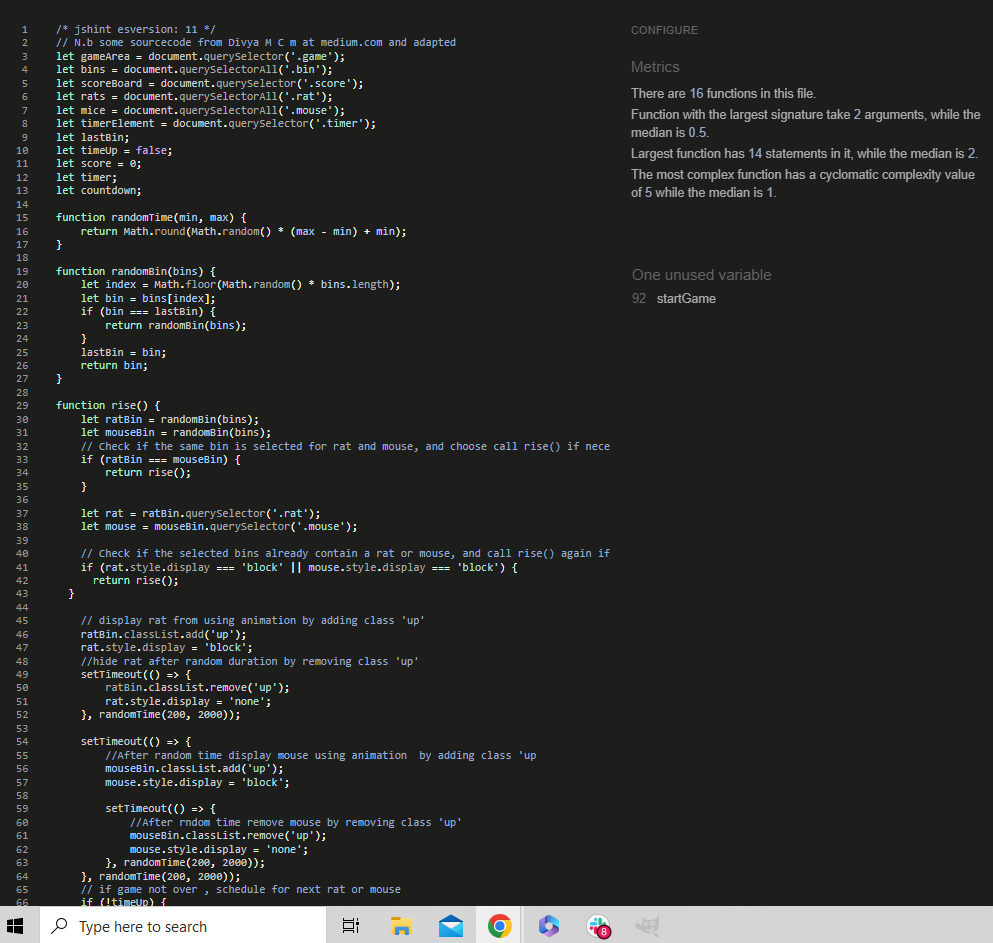

## Browser Compatibility

I have tested my deployed project with the following web browsers to check for compatability issues:

- [Chrome](https://www.google.com/chrome)
- [Firefox (Developer Edition)](https://www.mozilla.org/firefox/developer)
- [Edge](https://www.microsoft.com/edge)
- [Opera](https://www.opera.com/download)

| Browser | Page/Function | Expected Look | Expected Behaviour |
|---------|---------------|---------------|--------------------|
|  Chrome |  Index        |        Y      |          Y         |
|         |  Game play    |        Y      |          Y         |
|         |  Alert        |        Y      |          Y         |
|         |  Scoreboard   |        Y      |          Y         |
| Firefox |  Index        |        Y      |          Y         |
|         |  Game play    |        Y      |          Y         |
|         |  Alert        |        Y      |          Y         |
|         |  Scoreboard   |        Y      |          Y         |
|  Edge   |  Index        |        Y      |          Y         |
|         |  Game play    |        Y      |          Y         |
|         |  Alert        |        Y      |          Y         |
|         |  Scoreboard   |        Y      |          Y         |
|  Opera  |  Index        |        Y      |          Y         |
|         |  Gameplay     |        Y      |          Y         |
|         |  Alert        |        Y      |          Y         |
|         |  Scoreboard   |        Y      |          Y         |


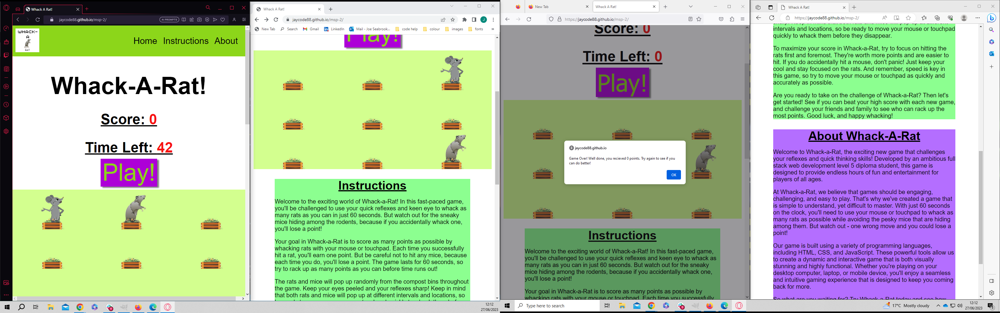

## Responsiveness

I've tested my deployed project on multiple devices to check for responsiveness issues. 

| Device    | Page/Area | Expected Look |
|-----------|-----------|---------------|
|Desktop 22"| Index     | Y             |
|           | Gameplay  | Y             |
|           | Alert     | Y             |
|           | Scoreboard| Y             |
|Laptop 16" | Index     | Y             |
|           | Gameplay  | Y             |
|           | Alert     | Y             |
|           | Scoreboard| Y             |
| Iphone 13 | Index     | Y             |
|           | Gameplay  | Y             |
|           | Alert     | Y             |
|           | Scoreboard| Y             |
|Galaxy S20 | Index     | Y             |
|           | Gameplay  | Y             |
|           | Alert     | Y             |
|           | Scoreboard| Y             |
|Tablet     | Index     | Y             |
|           | Gameplay  | Y             |
|           | Alert     | Y             |
|           | Scoreboard| Y             |

### Desktop

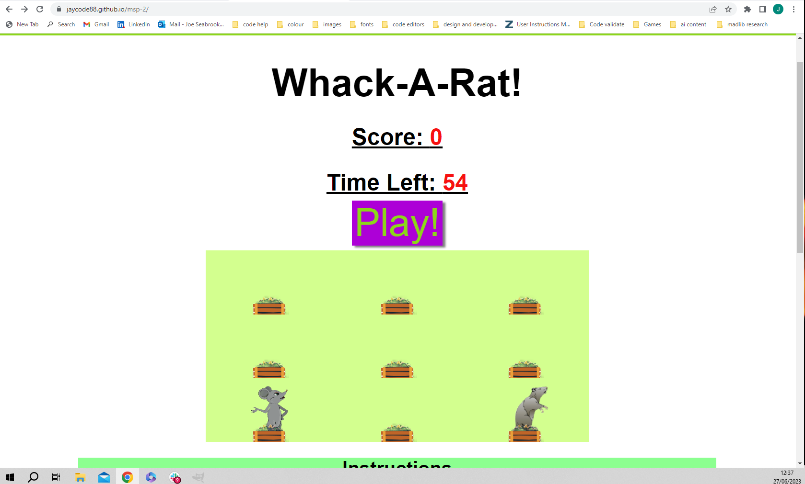

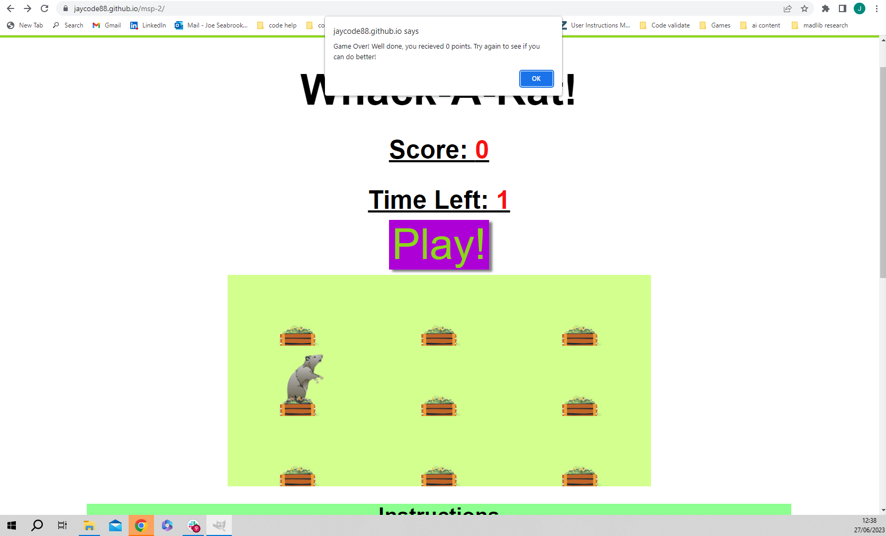

### Tablet

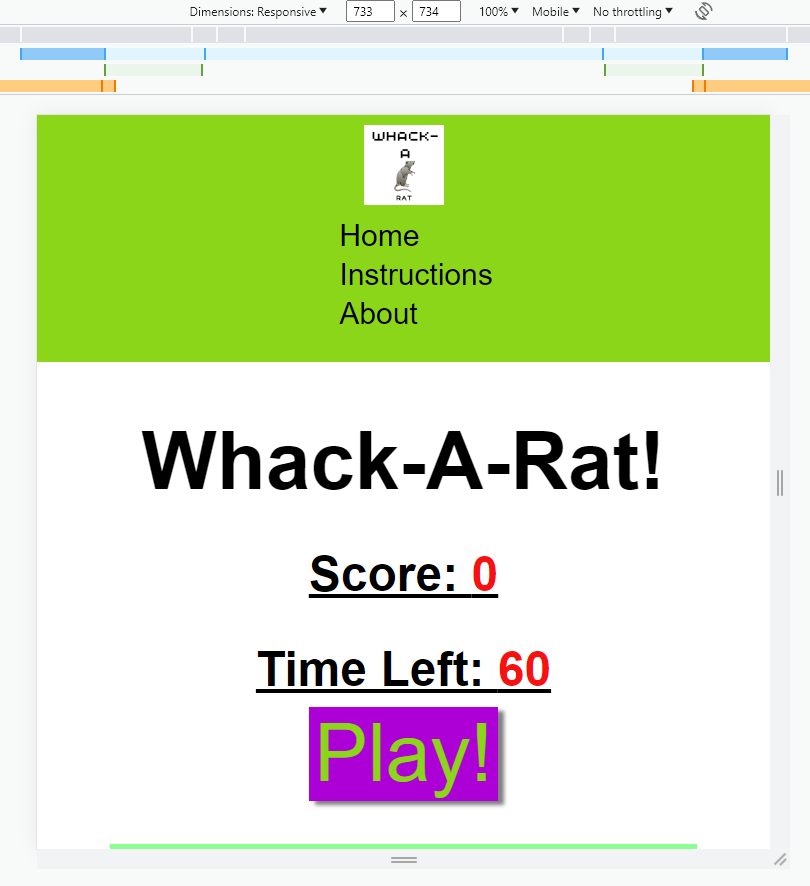

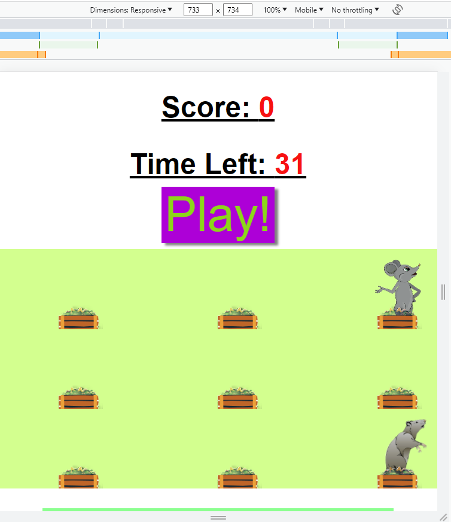

### Mobile

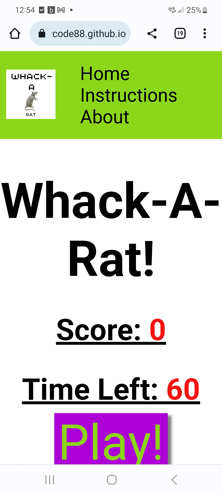

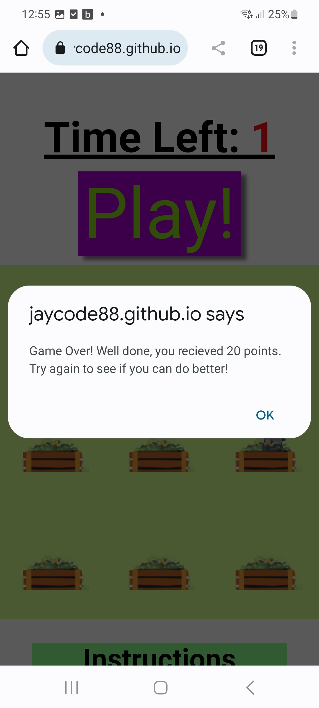

## Lighthouse Audit

### Desktop

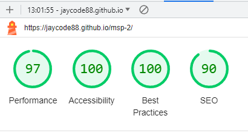

### Mobile

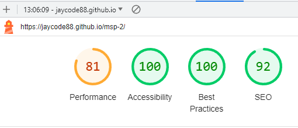


## Defensive Programming
Any Defensive code added is clearly marked with notes.

Defensive programming was manually tested with the below user acceptance testing:

| Page | User Action | Expected Result | Pass/Fail | Comments |
| --- | --- | --- | --- | --- |
| Home Page | | | | |
| | Click on Logo | Redirection to Home page | Pass | |
| | Click on Home link in navbar | Redirection to Home page | Pass | |
|  |Click on Instructions link   | Redirection to instructions on homepage | Pass | |
|  | Click on About link         | Redirection to about on homepage | Pass |  |
| | Click on "Play!" button | "Play!" button hide, Display gameArea, Start game, timer start, animal animation start | Pass |
|| Finishes game | Display Alert message informing score, Hide gameArea, Show "Play!"  button | Pass ||
|

## User Story Testing


| User Story | Screenshot |
| --- | --- |
| As a new site user, I would like toI would like to be able to read an understand the rules of gameplay, so that I can get engaged with the game effectively. |  |
| As a new site user, I would like to feel challenged, so that I can improve my reaction time and hand-eye cooordination skills. |  |
| As a new site user,  I would like to play a simple yet challenging game, so that I can De-stress or fill a gap in time. |  |
| As a new site user, I would like to feel engaged , so that I can forget whats on my mind and enjoy time out. |  |
| As a new site user, I would like to be able to navigate with ease, so that I can easily find what I am looking for. |  |
| As a returning site user, I would like to challenge myself, so that I can beat my previous highest score. |  |
| As a returning site user, I would like to compare my score with freinds or fammily, so that I can create fun competition. |  |
| As a site administrator, I should have the ability to manage the game itself, so that I can adjust game settings where needed. | Well noted code to assist |
|As a site administrator, I should be able to customise the game, so that I can modify visual elements or add new features. | Well noted code to assist |
| 

## Automated Testing

I have conducted a series of automated tests on my application.

I fully acknowledge and understand that, in a real-world scenario, an extensive set of additional tests would be more comprehensive.

### JavaScript (Jest Testing)

⚠️⚠️⚠️⚠️⚠️ START OF NOTES (to be deleted) ⚠️⚠️⚠️⚠️⚠️

Adjust the code below (file names, etc.) to match your own project files/folders.

🛑🛑🛑🛑🛑 END OF NOTES (to be deleted) 🛑🛑🛑🛑🛑

I have used the [Jest](https://jestjs.io) JavaScript testing framework to test the application functionality.

In order to work with Jest, I first had to initialize NPM.

- `npm init`
- Hit `enter` for all options, except for **test command:**, just type `jest`.

Add Jest to a list called **Dev Dependencies** in a dev environment:

- `npm install --save-dev jest`

**IMPORTANT**: Initial configurations

When creating test files, the name of the file needs to be `file-name.test.js` in order for Jest to properly work.

Due to a change in Jest's default configuration, you'll need to add the following code to the top of the `.test.js` file:

```js
/**
 * @jest-environment jsdom
 */

const { test, expect } = require("@jest/globals");
const { function1, function2, function3, etc. } = require("../script-name");

beforeAll(() => {
    let fs = require("fs");
    let fileContents = fs.readFileSync("index.html", "utf-8");
    document.open();
    document.write(fileContents);
    document.close();
});
```

Remember to adjust the `fs.readFileSync()` to the specific file you'd like you test.
The example above is testing the `index.html` file.

Finally, at the bottom of the script file where your primary scripts are written, include the following at the bottom of the file.
Make sure to include the name of all of your functions that are being tested in the `.test.js` file.

```js
if (typeof module !== "undefined") module.exports = {
    function1, function2, function3, etc.
};
```

Now that these steps have been undertaken, further tests can be written, and be expected to fail initially.
Write JS code that can get the tests to pass as part of the Red-Green refactor process.

Once ready, to run the tests, use this command:

- `npm test`

**NOTE**: To obtain a coverage report, use the following command:

- `npm test --coverage`

Below are the results from the tests that I've written for this application:

| Test Suites | Tests | Coverage | Screenshot |
| --- | --- | --- | --- |
| 1 passed | 16 passed | 55% |  |
| x | x | x | repeat for all remaining tests |

#### Jest Test Issues

⚠️⚠️⚠️⚠️⚠️ START OF NOTES (to be deleted) ⚠️⚠️⚠️⚠️⚠️

Use this section to list any known issues you ran into while writing your Jest tests.
Remember to include screenshots (where possible), and a solution to the issue (if known).

This can be used for both "fixed" and "unresolved" issues.

🛑🛑🛑🛑🛑 END OF NOTES (to be deleted) 🛑🛑🛑🛑🛑

## Bugs

N.B double click = double points solved
Rarely animals appear in same container even though code to stop this. attempted few diff ways of ammending but didnt stop problem completly decided to leave as it adds charachter to the animals and difficulty to the game.

⚠️⚠️⚠️⚠️⚠️ START OF NOTES (to be deleted) ⚠️⚠️⚠️⚠️⚠️

It's very important to document any bugs you've discovered while developing the project.
Make sure to include any necessary steps you've implemented to fix the bug(s) as well.

For JavaScript and Python applications, it's best to screenshot the errors to include them as well.

**PRO TIP**: screenshots of bugs are extremely helpful, and go a long way!

🛑🛑🛑🛑🛑 END OF NOTES (to be deleted) 🛑🛑🛑🛑🛑

- JS Uncaught ReferenceError: `foobar` is undefined/not defined

    

    - To fix this, I _____________________.

- JS `'let'` or `'const'` or `'template literal syntax'` or `'arrow function syntax (=>)'` is available in ES6 (use `'esversion: 11'`) or Mozilla JS extensions (use moz).

    

    - To fix this, I _____________________.

- Python `'ModuleNotFoundError'` when trying to import module from imported package

    

    - To fix this, I _____________________.

- Django `TemplateDoesNotExist` at /appname/path appname/template_name.html

    

    - To fix this, I _____________________.

- Python `E501 line too long` (93 > 79 characters)

    

    - To fix this, I _____________________.

### GitHub **Issues**

⚠️⚠️⚠️⚠️⚠️ START OF NOTES (to be deleted) ⚠️⚠️⚠️⚠️⚠️

An improved way to manage bugs is to use the built-in **Issues** tracker on your GitHub repository.
To access your Issues, click on the "Issues" tab at the top of your repository.
Alternatively, use this link: https://github.com/Jaycode88/msp-2/issues

If using the Issues tracker for your bug management, you can simplify the documentation process.
Issues allow you to directly paste screenshots into the issue without having to first save the screenshot locally,
then uploading into your project.

You can add labels to your issues (`bug`), assign yourself as the owner, and add comments/updates as you progress with fixing the issue(s).

Once you've sorted the issue, you should then "Close" it.

When showcasing your bug tracking for assessment, you can use the following format:

🛑🛑🛑🛑🛑 END OF NOTES (to be deleted) 🛑🛑🛑🛑🛑

**Fixed Bugs**

All previously closed/fixed bugs can be tracked [here](https://github.com/Jaycode88/msp-2/issues?q=is%3Aissue+is%3Aclosed).

| Bug | Status |
| --- | --- |
| [JS Uncaught ReferenceError: `foobar` is undefined/not defined](https://github.com/Jaycode88/msp-2/issues/1) | Closed |
| [Python `'ModuleNotFoundError'` when trying to import module from imported package](https://github.com/Jaycode88/msp-2/issues/2) | Closed |
| [Django `TemplateDoesNotExist` at /appname/path appname/template_name.html](https://github.com/Jaycode88/msp-2/issues/3) | Closed |

**Open Issues**

Any remaining open issues can be tracked [here](https://github.com/Jaycode88/msp-2/issues).

| Bug | Status |
| --- | --- |
| [JS `'let'` or `'const'` or `'template literal syntax'` or `'arrow function syntax (=>)'` is available in ES6 (use `'esversion: 11'`) or Mozilla JS extensions (use moz).](https://github.com/Jaycode88/msp-2/issues/4) | Open |
| [Python `E501 line too long` (93 > 79 characters)](https://github.com/Jaycode88/msp-2/issues/5) | Open |

## Unfixed Bugs

⚠️⚠️⚠️⚠️⚠️ START OF NOTES (to be deleted) ⚠️⚠️⚠️⚠️⚠️

You will need to mention unfixed bugs and why they were not fixed.
This section should include shortcomings of the frameworks or technologies used.
Although time can be a big variable to consider, paucity of time and difficulty understanding
implementation is not a valid reason to leave bugs unfixed.

If you've identified any unfixed bugs, no matter how small, be sure to list them here.
It's better to be honest and list them, because if it's not documented and an assessor finds the issue,
they need to know whether or not you're aware of them as well, and why you've not corrected/fixed them.

Some examples:

🛑🛑🛑🛑🛑 END OF NOTES (to be deleted) 🛑🛑🛑🛑🛑

- On devices smaller than 375px, the page starts to have `overflow-x` scrolling.

    

    - Attempted fix: I tried to add additional media queries to handle this, but things started becoming too small to read.

- For PP3, when using a helper `clear()` function, any text above the height of the terminal does not clear, and remains when you scroll up.

    

    - Attempted fix: I tried to adjust the terminal size, but it only resizes the actual terminal, not the allowable area for text.

- When validating HTML with a semantic `section` element, the validator warns about lacking a header `h2-h6`. This is acceptable.

    

    - Attempted fix: this is a known warning and acceptable, and my section doesn't require a header since it's dynamically added via JS.

⚠️⚠️⚠️⚠️⚠️ START OF NOTES (to be deleted) ⚠️⚠️⚠️⚠️⚠️

If you legitimately cannot find any unfixed bugs or warnings, then use the following sentence:

🛑🛑🛑🛑🛑 END OF NOTES (to be deleted) 🛑🛑🛑🛑🛑

There are no remaining bugs that I am aware of.
