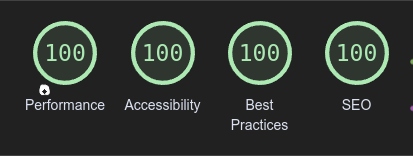
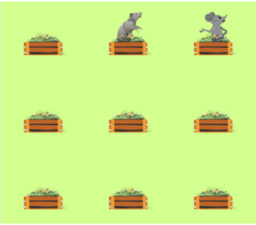

# Testing

Return back to the [README.md](README.md) file.

I have used various tools to Test Funcionality, Validity and responsiveness. I have been sure to check all layouts, colours, text, forms, links, buttons are functioning on all devices and screen sizes that I have tested.

## Code Validation

### HTML

I have used the recommended [HTML W3C Validator](https://validator.w3.org) to validate all of my HTML files.

- link to results: https://validator.w3.org/nu/?doc=https%3A%2F%2Fjaycode88.github.io%2Fmsp-2


### CSS

I have used the recommended [CSS Jigsaw Validator](https://jigsaw.w3.org/css-validator) to validate all of my CSS files.

- link to results: https://jigsaw.w3.org/css-validator/validator?uri=https%3A%2F%2Fjaycode88.github.io%2Fmsp-2%2F&profile=css3svg&usermedium=all&warning=1&vextwarning=&lang=en


### JavaScript

I have used the recommended [JShint Validator](https://jshint.com) to validate my JS file.


## Browser Compatibility

I have tested my deployed project with the following web browsers to check for compatability issues:

- [Chrome](https://www.google.com/chrome)
- [Firefox (Developer Edition)](https://www.mozilla.org/firefox/developer)
- [Edge](https://www.microsoft.com/edge)
- [Opera](https://www.opera.com/download)

| Browser | Page/Function | Expected Look | Expected Behaviour |
|---------|---------------|---------------|--------------------|
|  Chrome |  Index        |        Y      |          Y         |
|         |  Game play    |        Y      |          Y         |
|         |  Alert        |        Y      |          Y         |
|         |  Scoreboard   |        Y      |          Y         |
| Firefox |  Index        |        Y      |          Y         |
|         |  Game play    |        Y      |          Y         |
|         |  Alert        |        Y      |          Y         |
|         |  Scoreboard   |        Y      |          Y         |
|  Edge   |  Index        |        Y      |          Y         |
|         |  Game play    |        Y      |          Y         |
|         |  Alert        |        Y      |          Y         |
|         |  Scoreboard   |        Y      |          Y         |
|  Opera  |  Index        |        Y      |          Y         |
|         |  Gameplay     |        Y      |          Y         |
|         |  Alert        |        Y      |          Y         |
|         |  Scoreboard   |        Y      |          Y         |


## Responsiveness

I've tested my deployed project on multiple devices to check for responsiveness issues. 

| Device    | Page/Area | Expected Look |
|-----------|-----------|---------------|
|Desktop 22"| Index     | Y             |
|           | Gameplay  | Y             |
|           | Alert     | Y             |
|           | Scoreboard| Y             |
|Laptop 16" | Index     | Y             |
|           | Gameplay  | Y             |
|           | Alert     | Y             |
|           | Scoreboard| Y             |
| Iphone 13 | Index     | Y             |
|           | Gameplay  | Y             |
|           | Alert     | Y             |
|           | Scoreboard| Y             |
|Galaxy S20 | Index     | Y             |
|           | Gameplay  | Y             |
|           | Alert     | Y             |
|           | Scoreboard| Y             |
|Tablet     | Index     | Y             |
|           | Gameplay  | Y             |
|           | Alert     | Y             |
|           | Scoreboard| Y             |

### Desktop


### Tablet


### Mobile


## Lighthouse Audit

### Desktop


### Mobile




## Defensive Programming
Any Defensive code added is clearly marked with notes.

Defensive programming was manually tested with the below user acceptance testing:

| Page | User Action | Expected Result | Pass/Fail | Comments |
| --- | --- | --- | --- | --- |
| Home Page | | | | |
| | Click on Logo | Redirection to Home page | Pass | |
| | Click on Home link in navbar | Redirection to Home page | Pass | |
|  |Click on Instructions link   | Redirection to instructions on homepage | Pass | |
|  | Click on About link         | Redirection to about on homepage | Pass |  |
| | Click on "Play!" button | "Play!" button hide, Display gameArea, Start game, timer start, animal animation start | Pass |
|| Finishes game | Display Alert message informing score, Hide gameArea, Show "Play!"  button | Pass ||
|| Click Animal | Recieve correct points, Animal drop after whack | Pass | Before testing  User could gain double points by double clicking animal. Now solved see [bugs](#bugs).||
|| Play button clicked during game play | null | Pass | Did cause timer error. Now solved see [bugs](#bugs).||
|| Animals appear in same bin | Not too happen to often | Pass | for data from tests see [bugs](#bugs). ||
|

## User Story Testing


| User Story | Screenshot |
| --- | --- |
| As a new site user, I would like toI would like to be able to read an understand the rules of gameplay, so that I can get engaged with the game effectively. |  |
| As a new site user, I would like to feel challenged, so that I can improve my reaction time and hand-eye cooordination skills. |  |
| As a new site user,  I would like to play a simple yet challenging game, so that I can De-stress or fill a gap in time. |  |
| As a new site user, I would like to feel engaged , so that I can forget whats on my mind and enjoy time out. |  |
| As a new site user, I would like to be able to navigate with ease, so that I can easily find what I am looking for. |  |
| As a returning site user, I would like to challenge myself, so that I can beat my previous highest score. |  |
| As a returning site user, I would like to compare my score with freinds or fammily, so that I can create fun competition. |  |
| As a site administrator, I should have the ability to manage the game itself, so that I can adjust game settings where needed. | Well noted code to assist |
|As a site administrator, I should be able to customise the game, so that I can modify visual elements or add new features. | Well noted code to assist |
| 

## Automated Testing

I have conducted a series of automated tests on my application.

I fully acknowledge and understand that, in a real-world scenario, an extensive set of additional tests would be more comprehensive.

### JavaScript (Jest Testing)

I have used the [Jest](https://jestjs.io) version 26.6.3 JavaScript testing framework to test the application functionality.

In order to work with Jest, I first had to initialize NPM.

- `npm init`
- Hit `enter` for all options, except for **test command:**, just type `jest`.

Add Jest to a list called **Dev Dependencies** in a dev environment:

- `npm install --save-dev jest@26.6.3`

**IMPORTANT**: Initial configurations

When creating test files, the name of the file needs to be `file-name.test.js` in order for Jest to properly work.

Due to a change in Jest's default configuration, you'll need to add the following code to the top of the `.test.js` file:

```js
/**
 * @jest-environment jsdom
 */

jest.spyOn(window, "alert").mockImplementation(() => { });

const {
  startButton,
  scoreBoard,
  timerElement,
  timeUp,
  score,
  randomTime,
  checkCollision,
} = require("../game-script.js")


beforeAll(() => {
    let fs = require("fs");
    let fileContents = fs.readFileSync("index.html", "utf-8");
    document.open();
    document.write(fileContents);
    document.close();
});
```

Remember to adjust the `fs.readFileSync()` to the specific file you'd like you test.
The example above is testing the `index.html` file.

Finally, at the bottom of the script file where your primary scripts are written, include the following at the bottom of the file.
Make sure to include the name of all of your functions that are being tested in the `.test.js` file.

```js
module.exports = {
    startButton,
    scoreBoard,
    timerElement,
    timeUp,
    score,
    randomTime,
    checkCollision,
};
```

Now that these steps have been undertaken, further tests can be written, and be expected to fail initially.
Write JS code that can get the tests to pass as part of the Red-Green refactor process.

Once ready, to run the tests, use this command:

- `npm test`

**NOTE**: To obtain a coverage report, use the following command:

- `npm test --coverage`

Below are the results from the tests that I've written for this application:

| Test Suites | Tests | Screenshot ||
| --- | --- | --- | --- |
| 1 passed | 7 passed |  |


#### Jest Test Issues

I first attempted to set up my Jest tests by mocking the Dom, I found I was not able to pass the simplest of tests, I re-watched the walkthrough content and decided to use the Jest spy method which enabled me to pass the tests shown above.

After passing the 7 tests I went on to attemp to test the startGame function but ran into difficulty due to not being able to re-asign to constant variables. Therefore I attempted to change the imports from const to let, see below:
```js
let {
  startButton,
  scoreBoard,
  timerElement,
  timeUp,
  score,
  randomTime,
  checkCollision,
} = require("../game-script.js")
```
After this I first tried to test wether the startGame function was correctly disabling the start button but I ran into the error of" Cannot set properties of null". see below:


I decided to roll back a little and try something a more simple. I wrote a test to check that the startGame function  reset the scoreboard test content to "0". See below: 


When testing  I got a fail due to "Cannot set properties of null"  and cannot read properties of null". See below:


I attempted to define the variable in the test before using it which solved the error of "cannot set properties of null".


As I wasnt using all the code in the function for this very simple test, I noted out all code that was giving "cannot read properties of null".


I ran the test and recieved a fail. It would seem that the function is not being called in the test correctly.


I did look into how to mock functions and made a few attempts but without a more comprehensive coverage of jest testing in the course content, I found it extremely hard to move foward.

## Bugs

### Fixed bugs

When first testing I noticed that when playing on desktop, If the user double-clicked on the animal they gained double points. I added code to remove the click event listener for jus 0.25 seconds while the animal dissapeared again. This solved the problem.


On all devices if the user clicked the "Play!" Button during the game, The timer would flick through as if it was trying to display 2 or 3 timers at once with different times. To solve the error I chose to remove and disable the "play!" button whilst the game was in play and have it re-appear and be enabled at the end of game play. See code added below..

```js
function startGame() {
    startButton.disabled = true; // Disable the play button
    startButton.style.display = 'none'; // Hide the play button
   
}

function endGame() {
     startButton.disabled = false; // enable the play button
    startButton.style.display = 'inline-block'; // show the play button
}
```

### Open Issues
Animals Do Appear in the same bin occasionally. I added code during the build process that Stopped the animals rising in the same bins at a high rate, how ever I found it did still happen on occassion.

Code added during build phase to stop collision:
```js
function rise() {
    let ratBin = randomBin(bins);
    let mouseBin = randomBin(bins);
    // Check if the same bin is selected for rat and mouse, and call rise() if necessary
    if (ratBin === mouseBin || checkCollision(ratBin) || checkCollision(mouseBin)) {
        return rise(); // Collision detected or same bin selected, choose new bins
      }
}
function riseFrog() {
    if (frogCount >= maxFrogCount) {
        return; // Limit reached, stop appearing frogs
    }

    let frogBin = randomBin(bins);

    if (checkCollision(frogBin)) {
        return riseFrog();
    }     
}
```
I ran manual game play tests to see the rate of collision still happening per game. Please see results below:

| No. of collisions in game | No. of games |
| --- | --- | 
| 0   |  5  |
| 1   |  5  |
| 2   |  1  |
|

After performing these manual tests I found that whilst collisions were not happening a great amount, They contributed another challenging element to the game as well as conforming with the instructions that inform of the mouse being "sneaky", As It seemed when collision did happen it was mostly the mouse appearing to jump infront of the rat.

The user can change their score via the console in google developer tools. I did research and found that I could make it harder for the user to modify their score by creating an update score function that the other functions used to change the scores when whacks are achieved, How ever when I tested this It was still very easy for the user to update the score. I decided that the game is a personal challenge and see no real problem for me as a site administrator if users want to cheat themselves.
As noted in the future features section of the [README.md](README.md) I would like to add a server side scoreboard so that I can create a leader board etc, This will make it much harder for the user to modify scores in the console.


